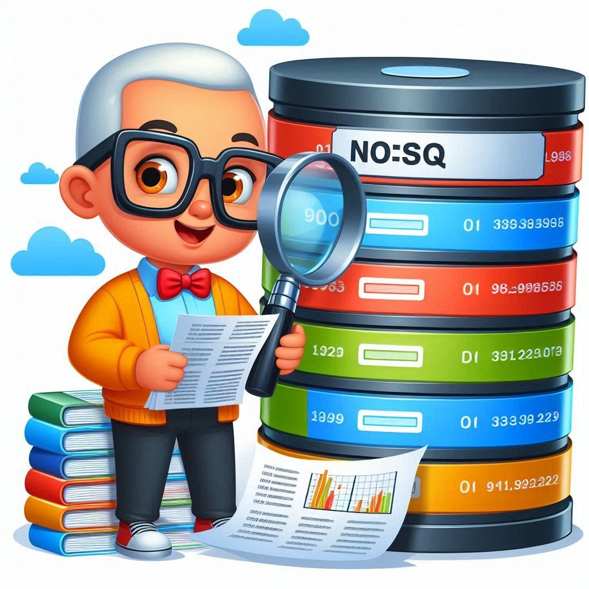
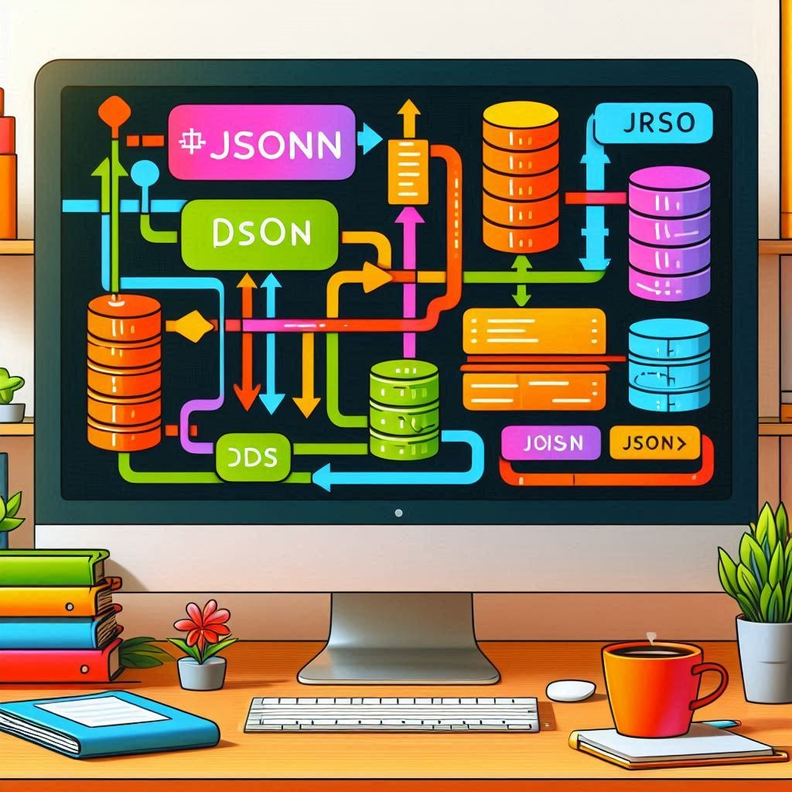
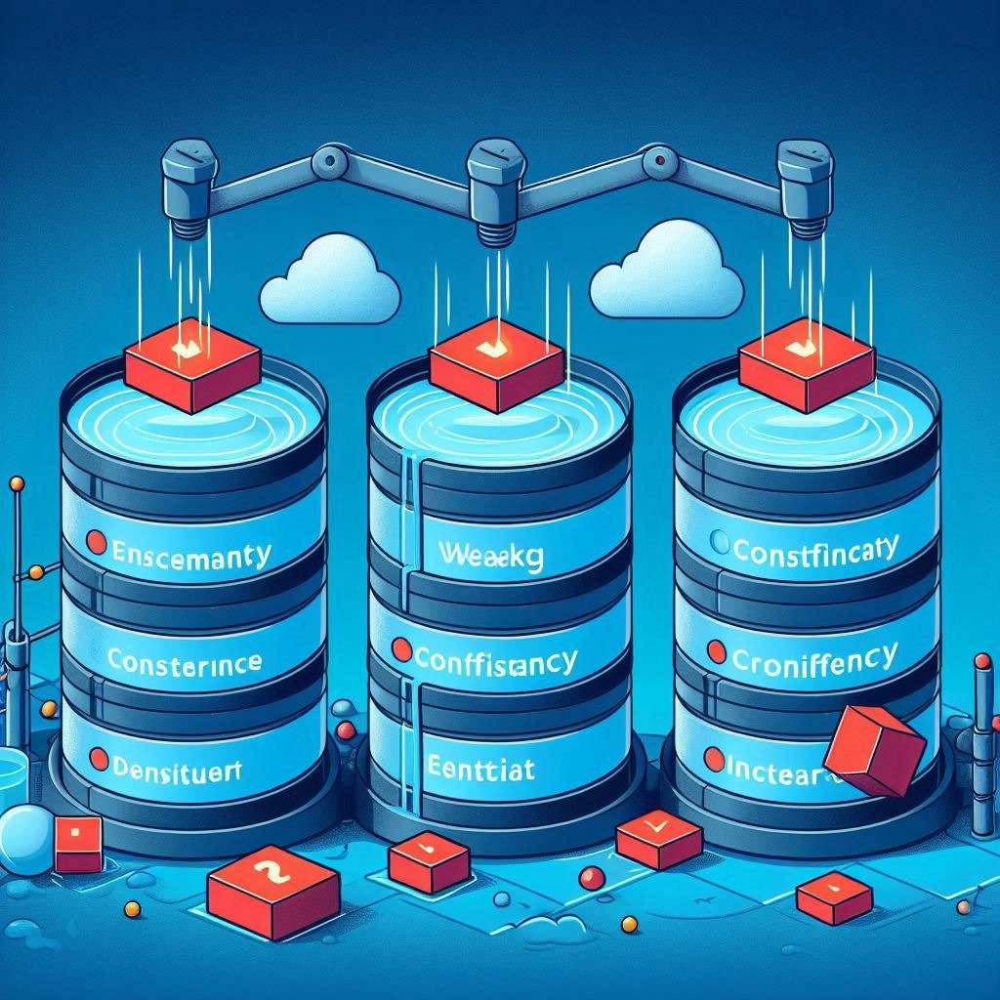
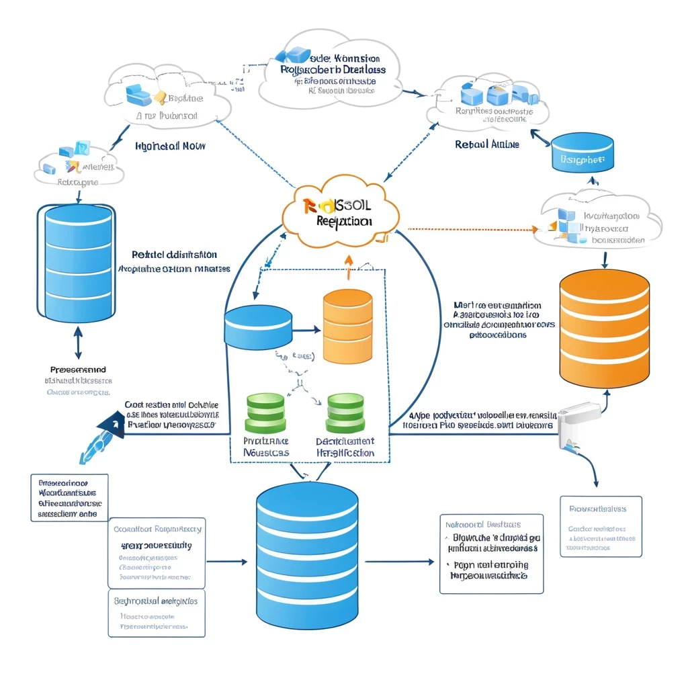
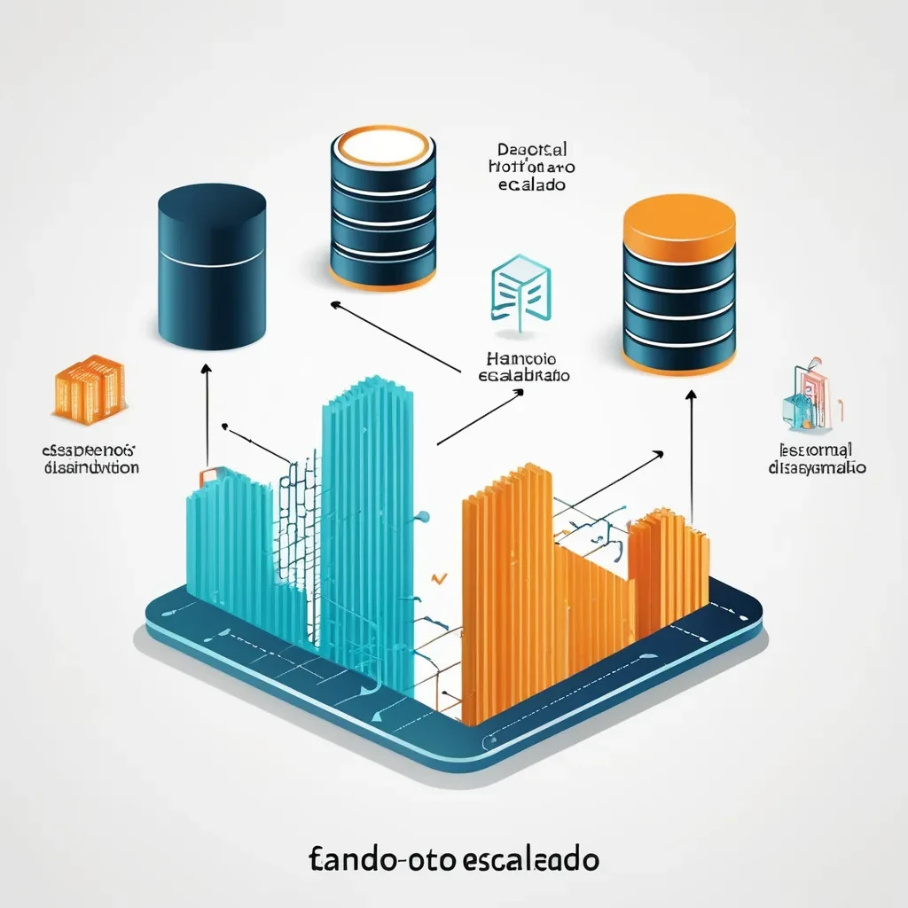
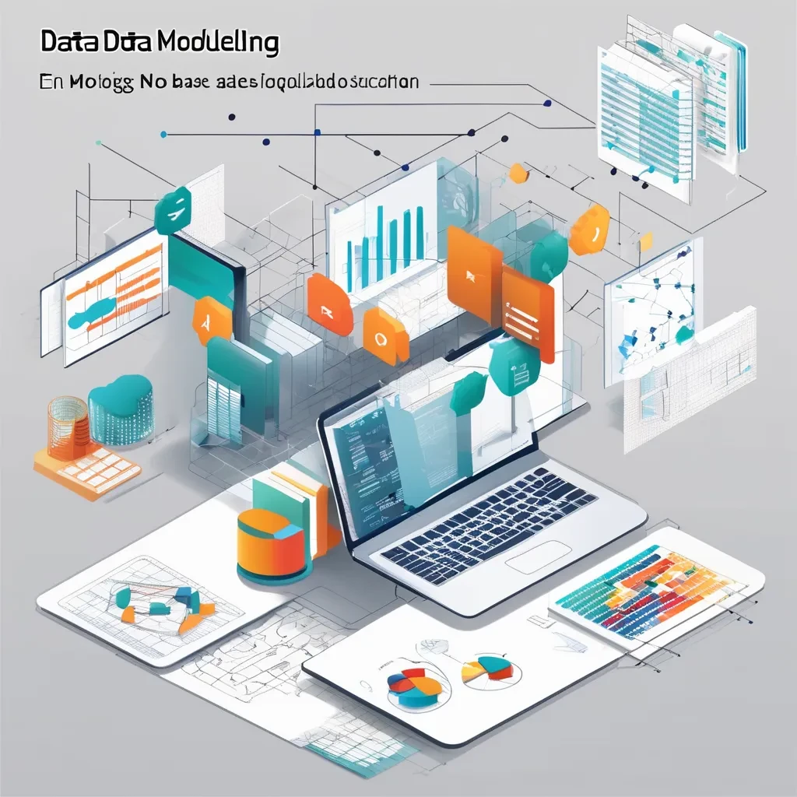
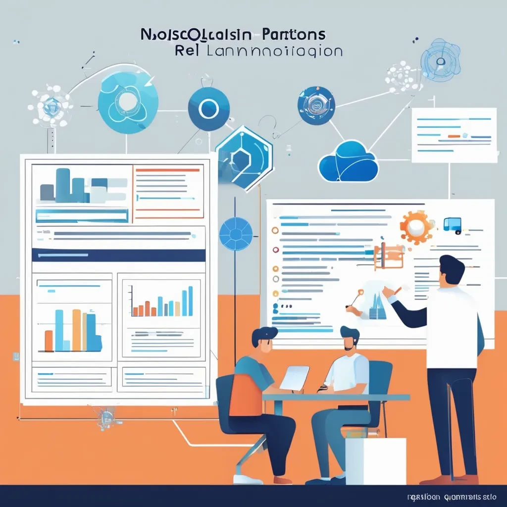

# Conceptos Relevantes NOSQL 

***~Autores: 
Flor Ontiveros Martinez y Laura Fernanda Medellin Osorio~~*** 

 ## 1. Introducción a NoSQL y su Evolución Histórica

### Orígenes y Contexto Previo a NoSQL

Décadas de 1960-1970: 

> Las primeras bases de datos eran principalmente jerárquicas y de red, con estructuras rígidas. Con el tiempo, el modelo relacional propuesto por Edgar F. Codd en 1970 revolucionó la forma de manejar datos, y las bases de datos relacionales (SQL) dominaron las siguientes décadas.

Década de 1980-1990: 

>Las bases de datos relacionales se convirtieron en el estándar de la industria, y su popularidad creció con el avance de los sistemas de gestión como Oracle, MySQL, y Microsoft SQL Server. Sin embargo, con el auge de la web y las aplicaciones de gran escala, comenzaron a surgir las limitaciones de este modelo en términos de escalabilidad y flexibilidad.

### Nacimiento del Movimiento NoSQL

Años 2000: 

>Con el crecimiento exponencial de los datos y la necesidad de manejar grandes volúmenes de información en sistemas distribuidos, las bases de datos NoSQL comenzaron a emerger. Este movimiento fue impulsado por gigantes tecnológicos como Google, Amazon, y Facebook, que necesitaban soluciones más escalables y flexibles que las ofrecidas por las bases de datos relacionales tradicionales.

2000-2005: 

>La creación de Google Bigtable en 2005 y Amazon Dynamo en 2007 marcó hitos importantes en el desarrollo de sistemas de almacenamiento distribuidos. Ambos sistemas se diseñaron para manejar datos a una escala masiva y sirvieron de inspiración para otras bases de datos NoSQL.

### Proliferación y Adopciones Tempranas

2008-2010: 

>Esta fue una época de rápida adopción y diversificación de las bases de datos NoSQL. MongoDB (2009) se lanzó como una base de datos orientada a documentos que ganó popularidad por su flexibilidad y facilidad de uso. 
Apache Cassandra (2008), basado en la combinación de Bigtable y Dynamo, ofreció alta disponibilidad y escalabilidad sin un punto único de falla.

### Expansión y Diversificación

Década de 2010: 

>Las bases de datos NoSQL se integraron en muchas industrias más allá del sector tecnológico. Surgieron soluciones especializadas como Redis, un almacén en memoria, y sistemas híbridos como Couchbase, que combinaba capacidades de documentos y memoria.

Años 2010s: 

>Comenzaron a surgir soluciones que combinaban lo mejor de los modelos SQL y NoSQL, como las bases de datos multi-modelo y las bases de datos distribuidas que ofrecen transacciones ACID sobre arquitecturas distribuidas.

### Consolidación y Futuro

2020 en adelante: 

>Las bases de datos NoSQL continúan evolucionando, con un enfoque en la nube, la integración de microservicios, y la adopción de arquitecturas híbridas que permiten manejar tanto datos estructurados como no estructurados de manera eficiente. Sistemas como Amazon DynamoDB y Google Cloud Spanner representan la convergencia de modelos SQL y NoSQL, combinando la flexibilidad y escalabilidad de NoSQL con la consistencia y el modelado de datos de SQL.

## 2. JSON y BSON en NoSQL

### JSON (JavaScript Object Notation) 

Se trata de un formato para guardar e intercambiar información que cualquier persona pueda leer. Los archivos json contienen solo texto y usan la extensión .json.

### BSON (Binary JSON)

Formato de intercambio de datos usado principalmente para su almacenamiento y transferencia en la base de datos MongoDB. Es una representación binaria de estructuras de datos y mapas. 

### ¿Cómo se utilizan en bases de datos NoSQL como MongoDB para almacenar y representar datos?

>### JSON

#### Entrada de Datos

En MongoDB, cuando los usuarios insertan datos o interactúan con la base de datos, utilizan el formato JSON. Por ejemplo, al insertar un nuevo documento en una colección, se escribe en formato JSON.

> ### BSON

#### Almacenamiento de datos

Cuando un documento JSON es insertado en MongoDB, el servidor convierte automáticamente ese documento JSON en BSON antes de almacenarlo en la base de datos. Esta conversión permite que MongoDB maneje los datos de manera más eficiente.

#### Proceso de Conversión:

* El usuario inserta un documento en JSON.
* MongoDB convierte ese documento JSON a BSON internamente.
* El documento se almacena en el disco en formato BSON.

#### Procesamiento de Datos

MongoDB procesa los datos en formato BSON para realizar operaciones de consulta, indexación y manipulación de datos de manera eficiente. Cuando los datos son devueltos al usuario o a una aplicación, se reconvierten a JSON.

## 3. Comparación de Consistencia Eventual y Consistencia Débil

**Diferencias**
------------------------------------------------
> ### Consistencia Eventual  
------------------------------------------------   
* Asegura que los datos se sincronizarán eventualmente entre todos los nodos.        
------
* La precisión puede verse comprometida temporalmente, pero se recupera con el tiempo.
---
* Adecuada para aplicaciones donde la eventual consistencia es aceptable, como en sistemas donde la latencia es más crítica que la consistencia inmediata.
------
### Impacto en la precisión de los Datos:
-----
* En ciertos momentos, los usuarios pueden recibir datos desactualizados o inconsistentes dependiendo de qué nodo responda a su solicitud.

* A largo plazo, todos los nodos tendrán datos consistentes, pero esto no ocurre inmediatamente después de una actualización.
------
> ### Consistencia Débil
------
* No garantiza la convergencia; los datos pueden permanecer inconsistentes indefinidamente.
----
* La precisión puede estar comprometida de manera más severa y permanente, dependiendo de la implementación.
-----
* Adecuada para sistemas que requieren alta disponibilidad y latencia baja, pero donde la aplicación puede tolerar y manejar inconsistencias.
----
> ### Impacto en la precisión de los Datos:
----
* Los datos pueden no ser precisos en ningún momento, y las diferencias entre nodos podrían no resolverse sin intervención externa.
----
* Puede llevar a situaciones donde diferentes usuarios vean datos conflictivos o donde se produzcan resultados inesperados debido a la falta de sincronización entre nodos.
---

## 4. Tipos de Bases de Datos NoSQL y sus Casos de Uso Comunes

* ### Bases de Datos Orientadas a Documentos:

    Almacenan datos en documentos, generalmente en formato JSON, BSON (Binary JSON), o XML. Cada documento es una estructura de datos independiente que puede contener pares clave-valor, listas, u otros documentos anidados.

* ### Almacenes Clave-Valor:

    Almacenan datos como pares clave-valor, donde cada clave es única y se asocia con un valor, que puede ser un simple dato o un objeto complejo. Son extremadamente rápidas para operaciones de lectura y escritura.

* ### Bases de Datos de Grafos:

    Están diseñadas para almacenar y gestionar datos altamente conectados. Los datos se representan como nodos (entidades) y aristas (relaciones), lo que permite modelar relaciones complejas de manera eficiente.

* ### Almacenes de Columna:

    Estas bases de datos almacenan datos en columnas en lugar de filas, lo que permite un acceso más eficiente a grandes cantidades de datos en columnas específicas. 

* ### Bases de Datos Multimodelo:

    Estas bases de datos soportan múltiples modelos de datos (por ejemplo, documentos, grafos, clave-valor, etc.) en un solo sistema. Ofrecen flexibilidad para manejar diferentes tipos de datos y relaciones dentro de una única base de datos.

----
 
 

---

# 5.- Configuración de Replicación en NoSQL
Explica cómo configurar la replicación en bases de datos NoSQL para mejorar la disponibilidad y la tolerancia a fallos.

MongoDB
Utiliza un conjunto de réplicas para la replicación. Un conjunto de réplicas es un grupo de instancias de MongoDB que mantienen los mismos datos.

Pasos básicos para configurar un conjunto de réplicas
1.Instalar MongoDB en todos los servidores que formarán parte del conjunto de réplicas.

2.Configurar el archivo de configuración (mongod.conf) para cada instancia, asegurándote de especificar el mismo replicaSet para todas.

3.Iniciar las instancias de MongoDB con el comando mongod --config /path/to/mongod.conf.

4.Conectar a una instancia y ejecutar el siguiente comando para inicializar el conjunto de réplicas:

  rs.initiate({

_id: "rs0",

members: [

{ _id: 0, host: "server1:27017" },

{ _id: 1, host: "server2:27017" },

{ _id: 2, host: "server3:27017" }

]

})

5.Verificar el estado del conjunto de réplicas con rs.status().

# 6.- Fundamentos del Escalado Horizontal en NoSQL
Describe qué es el escalado horizontal y cómo se implementa en bases de datos NoSQL para manejar grandes volúmenes de datos y cargas de trabajo distribuidas.

El escalado horizontal es una técnica utilizada para aumentar la capacidad de una base de datos añadiendo más servidores o nodos en lugar de mejorar las capacidades de un solo servidor (escalado vertical). En el contexto de bases de datos NoSQL, el escalado horizontal es especialmente relevante debido a su capacidad para manejar grandes volúmenes de datos y cargas de trabajo distribuidas de manera eficiente.

  Particionamiento (Sharding):
Descripción: Divide los datos en fragmentos más pequeños llamados “shards”, que se distribuyen en diferentes servidores.

Ventaja: Permite que cada servidor maneje solo una parte del conjunto de datos, mejorando el rendimiento y la capacidad de almacenamiento.

Ejemplo: MongoDB y Cassandra utilizan particionamiento para distribuir datos.

  Replicación:
Descripción: Copia los datos en múltiples servidores para asegurar la disponibilidad y la tolerancia a fallos.

Ventaja: Si un servidor falla, otro puede tomar su lugar sin pérdida de datos.

Ejemplo: Couchbase y Redis implementan replicación para asegurar la alta disponibilidad.

# 7.-Data Modeling en Bases de Datos NoSQL
Investiga las mejores prácticas para modelar datos en bases de datos NoSQL, incluyendo el diseño de esquemas flexibles y el uso de documentos anidados.

El modelado de datos en bases de datos NoSQL requiere un enfoque diferente al de las bases de datos relacionales debido a su naturaleza flexible y sin esquema. Aquí te presento algunas de las mejores prácticas para modelar datos en bases de datos NoSQL:

     Diseño de Esquemas Flexibles:

Descripción: Aprovecha la flexibilidad de NoSQL para crear esquemas que puedan evolucionar con el tiempo sin necesidad de migraciones complejas.

Ventaja: Facilita la adaptación a cambios en los requisitos de la aplicación.

Ejemplo: MongoDB permite agregar nuevos campos a los documentos sin afectar a los documentos existentes.

    Uso de Documentos Anidados:

Descripción: Utiliza documentos anidados para representar relaciones jerárquicas y evitar la necesidad de uniones (joins).

Ventaja: Mejora el rendimiento al reducir la cantidad de consultas necesarias para obtener datos relacionados.

Ejemplo: En una base de datos de comercio electrónico, un documento de “pedido” puede incluir una lista anidada de “productos”.

# 8.- Capacidades de Búsqueda y Consultas en NoSQL
Analiza cómo se realizan las búsquedas y consultas en bases de datos NoSQL, incluyendo las limitaciones en comparación con SQL y ejemplos prácticos de diferentes sistemas NoSQL.

Las búsquedas y consultas en bases de datos NoSQL se realizan de manera diferente a las bases de datos relacionales (SQL) debido a sus modelos de datos flexibles y sin esquema. Aquí te presento un análisis de cómo se llevan a cabo estas operaciones, sus limitaciones y algunos ejemplos prácticos en diferentes sistemas NoSQL.

Lenguajes de Consulta:

MongoDB: Utiliza un lenguaje de consulta basado en JSON. 
Ejemplo: Consulta Básica: db.usuarios.find({ "edad": { $gt: 25 } }) - Encuentra usuarios mayores de 25 años.

Cassandra: Utiliza CQL (Cassandra Query Language), similar a SQL. 
Ejemplo: Consulta Básica: SELECT * FROM usuarios WHERE apellido = 'García'; - Encuentra usuarios con el apellido García.

Limitaciones en Comparación con SQL

1.Uniones (Joins):

NoSQL: Generalmente no soportan uniones complejas debido a su diseño distribuido.
SQL: Soporta uniones complejas entre múltiples tablas.

2.Consistencia:

NoSQL: A menudo implementan consistencia eventual, lo que puede resultar en datos temporalmente inconsistentes.

SQL: Ofrecen consistencia fuerte mediante transacciones ACID.

3.Esquema:

NoSQL: Esquema flexible, permite cambios dinámicos en la estructura de los datos.

SQL: Esquema rígido, requiere definiciones previas y migraciones para cambios.

4.Consultas Complejas:

NoSQL: Limitadas en la capacidad de realizar consultas complejas debido a la falta de un lenguaje de consulta estandarizado.

SQL: Potente para consultas complejas y análisis de datos.

# 9.- Indexación Básica en NoSQL
Describe cómo funcionan los índices en bases de datos NoSQL, los diferentes tipos de índices disponibles y cómo afectan el rendimiento de las consultas.

  Funcionamiento de los Índices en NoSQL
Estructura de Índices:

Descripción: Los índices son estructuras de datos que permiten acceder rápidamente a los datos en función de los valores de una o más columnas.

Ventaja: Mejoran significativamente el rendimiento de las consultas al reducir el número de registros que deben ser escaneados.

Creación de Índices:

Descripción: Los índices se crean en campos específicos de los documentos o registros para acelerar las consultas.

Ejemplo: En MongoDB, se puede crear un índice en el campo “nombre” con el comando db.collection.createIndex({ nombre: 1 }).

  Tipos de Índices en NoSQL

Índices Primarios:

Descripción: Índices creados automáticamente en la clave primaria de cada documento o registro.

Ejemplo: En Cassandra, cada tabla tiene un índice primario basado en la clave de partición.

Índices Secundarios:

Descripción: Índices adicionales creados en campos que no son claves primarias para mejorar el rendimiento de las consultas.

Ejemplo: En MongoDB, se puede crear un índice secundario en el campo “edad” con db.collection.createIndex({ edad: 1 }).

Índices Compuestos:

Descripción: Índices que abarcan múltiples campos para optimizar consultas que filtran por más de un campo.

Ejemplo: En MongoDB, un índice compuesto en los campos “nombre” y “edad” se crea con db.collection.createIndex({ nombre: 1, edad: 1 }).

Índices Geoespaciales:

Descripción: Índices diseñados para consultas geoespaciales, como búsquedas de proximidad.

Ejemplo: En MongoDB, se puede crear un índice geoespacial en un campo de coordenadas con db.collection.createIndex({ ubicacion: "2dsphere" }).

Índices de Texto:

Descripción: Índices que permiten realizar búsquedas de texto completo en campos específicos.

Ejemplo: En MongoDB, se puede crear un índice de texto en el campo “descripcion” con db.collection.createIndex({ descripcion: "text" }).

  Impacto en el Rendimiento de las Consultas

Mejora del Rendimiento:

Descripción: Los índices reducen el tiempo de búsqueda al permitir que la base de datos localice rápidamente los registros relevantes.

Ventaja: Acelera las consultas de lectura, especialmente en grandes volúmenes de datos.

Costos de Escritura:

Descripción: La creación y mantenimiento de índices puede aumentar el tiempo de las operaciones de escritura, ya que cada inserción, actualización o eliminación de datos requiere actualizar los índices correspondientes.

Desventaja: Puede afectar el rendimiento de las operaciones de escritura en sistemas con alta carga de escritura.

Uso de Espacio:

Descripción: Los índices ocupan espacio adicional en el almacenamiento.

Desventaja: Puede aumentar los requisitos de almacenamiento, especialmente si se crean muchos índices.

# 10.- Manejo de Datos No Estructurados y Semiestructurados en NoSQL
Explica cómo las bases de datos NoSQL manejan datos no estructurados y semiestructurados, proporcionando ejemplos de cuándo y por qué se utilizaría cada enfoque.

    Datos No Estructurados
Definición: Los datos no estructurados no siguen un formato predefinido o un esquema rígido. Ejemplos incluyen texto libre, imágenes, videos y archivos de audio.

Manejo en NoSQL:

--Almacenamiento de Documentos:

Ejemplo: MongoDB y CouchDB almacenan datos en formato JSON o BSON, lo que permite almacenar documentos con estructuras variadas.

Uso: Ideal para aplicaciones que manejan grandes volúmenes de datos heterogéneos, como redes sociales y sistemas de gestión de contenido.

--Almacenamiento de Archivos:

Ejemplo: Bases de datos como Cassandra pueden almacenar grandes archivos binarios (BLOBs).

Uso: Adecuado para aplicaciones que necesitan almacenar y recuperar archivos multimedia, como servicios de streaming.

     Datos Semiestructurados
Definición: Los datos semiestructurados tienen una estructura flexible que no se ajusta completamente a un esquema rígido, pero contienen etiquetas o marcadores que los organizan. Ejemplos incluyen XML, JSON y YAML.

Manejo en NoSQL:

--Bases de Datos de Documentos:

Ejemplo: MongoDB permite almacenar documentos JSON que pueden contener datos anidados y estructuras complejas.

Uso: Útil para aplicaciones que requieren flexibilidad en el esquema, como 
aplicaciones web y móviles que evolucionan rápidamente.

Bases de Datos de Grafos:

Ejemplo:  almacena datos en nodos y relaciones, lo que permite representar datos semiestructurados de manera eficiente.

Uso: Ideal para aplicaciones que manejan relaciones complejas, como redes sociales y sistemas de recomendación.

MongoDB:

Datos No Estructurados: Almacenar registros de logs de aplicaciones en formato JSON.

Datos Semiestructurados: Almacenar perfiles de usuarios con campos opcionales y anidados.

# 11.- Introducción a la Replicación y Particionamiento en NoSQL
Proporciona una explicación básica sobre cómo se manejan la replicación y el particionamiento en bases de datos NoSQL, y por qué son importantes para la escalabilidad y la disponibilidad.

Replicación

La replicación implica copiar y mantener datos en múltiples nodos. Esto asegura que, si un nodo falla, los datos aún estén disponibles en otros nodos. Hay varios tipos de replicación:

Replicación Maestro-Esclavo: 
Un nodo maestro maneja todas las escrituras y distribuye las actualizaciones a los nodos esclavos, que solo manejan lecturas.

Replicación Multi-Maestro: 
Todos los nodos pueden manejar escrituras y lecturas, lo que mejora la disponibilidad y la tolerancia a fallos.

Particionamiento (Sharding)

El particionamiento divide la base de datos en fragmentos más pequeños, llamados shards, que se distribuyen en diferentes nodos. Esto permite manejar grandes volúmenes de datos y mejorar el rendimiento. Hay dos métodos principales de particionamiento:

Particionamiento por Rango: Los datos se dividen en rangos específicos y cada rango se almacena en un shard diferente.

Particionamiento por Hash: Los datos se distribuyen en shards basados en el valor hash de una clave, lo que asegura una distribución uniforme.

## Referencias 
* This site was built using [Evolucion historica](https://www.tecnologias-informacion.com/historiabbdd.html).

* This site was built using [Evolucion](https://sg.com.mx/revista/28/nosql-evolucion-bases-datos).

* 8This site was built using [BASE DE DATOS NOSQL](https://www.ibm.com/mx-es/topics/nosql-databases).

* This site was built using [JSON Y BSON](https://www.mongodb.com/resources/basics/json-and-bson).

* This site was built using [Tipos](https://www.arsys.es/blog/bases-de-datos-nosql-que-son-tipos-y-ventajas).

* This site was built using [GitHub Pages](https://hackernoon.com/lang/es/eventual-vs-consistencia-fuerte-en-bases-de-datos-distribuidas-282fdad37cf7).

* This site was built using [GitHub Pages](https://www.oracle.com/mx/database/nosql/what-is-nosql/).

NoSQL: Modelos de base de datos no relacionales. (2022, October 10). The Data Schools; MANUEL. https://thedataschools.com/que-es/nosql/

¿Qué es NoSQL? (n.d.). Oracle.com. Retrieved August 30, 2024, from https://www.oracle.com/mx/database/nosql/what-is-nosql/

SQL vs. NoSQL: Comparación completa de características, diferencias y más. (2024, May 3). Testgorilla.com; TestGorilla. https://www.testgorilla.com/es/blog/sql-vs-nosql/

(N.d.). Bing.com. Retrieved August 30, 2024, from http://edgeservices.bing.com/edgesvc/redirect?url=https%3A%2F%2Fwww.oracle.com%2Fmx%2Fdatabase%2Fnosql%2Fwhat-is-nosql%2F&hash=q%2FCn5vng5rMEH7Qpn%2Fg5VBXnYIjM7xJFtAX99xRrK8c%3D&key=psc-underside&usparams=cvid%3A51D%7CBingProd%7CA4D82A62EE951C5781CBD82CFEB28C7B6CF1A2CDB3478CE15BB24FBBA4D74B63%5Ertone%3ABalanced

Bases de datos NoSQL: características y tipos. (2023, January 2). Stackscale. https://www.stackscale.com/es/blog/bases-de-datos-nosql/

¿Qué es una base de datos NoSQL? (2024, April 14). Ibm.com. https://www.ibm.com/es-es/topics/nosql-databases

Soluciones prácticas para bases de datos NoSQL (con ejemplos). (2024, May 3). OpenSistemas. https://opensistemas.com/soluciones-practicas-para-bases-de-datos-nosql/

(N.d.). Mongodb.com. Retrieved August 30, 2024, from https://www.mongodb.com/es/resources/basics/databases/nosql-explained

Introducción a NoSQL: Diferencias con SQL y Casos de Uso. (n.d.). Entredata.org. Retrieved August 30, 2024, from https://www.entredata.org/fundamentos-de-sql/introduccion-a-nosql-diferencias-con-sql-y-casos-de-uso

Manejo de Datos No Estructurados y Semiestructurados en NoSQL. (n.d.). Bing. Retrieved August 30, 2024, from https://www.bing.com/search?q=Manejo+de+Datos+No+Estructurados+y+Semiestructurados+en+NoSQL&FORM=bngcht&toWww=1&redig=730B7D288ADB4648BF270415A9E38C82

Soluciones prácticas para bases de datos NoSQL (con ejemplos). (2024, May 3). OpenSistemas. https://opensistemas.com/soluciones-practicas-para-bases-de-datos-nosql/

(N.d.-a). Edu.Ar. Retrieved August 30, 2024, from https://sedici.unlp.edu.ar/bitstream/handle/10915/48085/Documento_completo__.pdf?sequence=1

(N.d.-b). Edu.Ar. Retrieved August 30, 2024, from http://sedici.unlp.edu.ar/bitstream/handle/10915/48085/Presentaci%C3%B3n__diapositivas_.pdf?sequence=2
